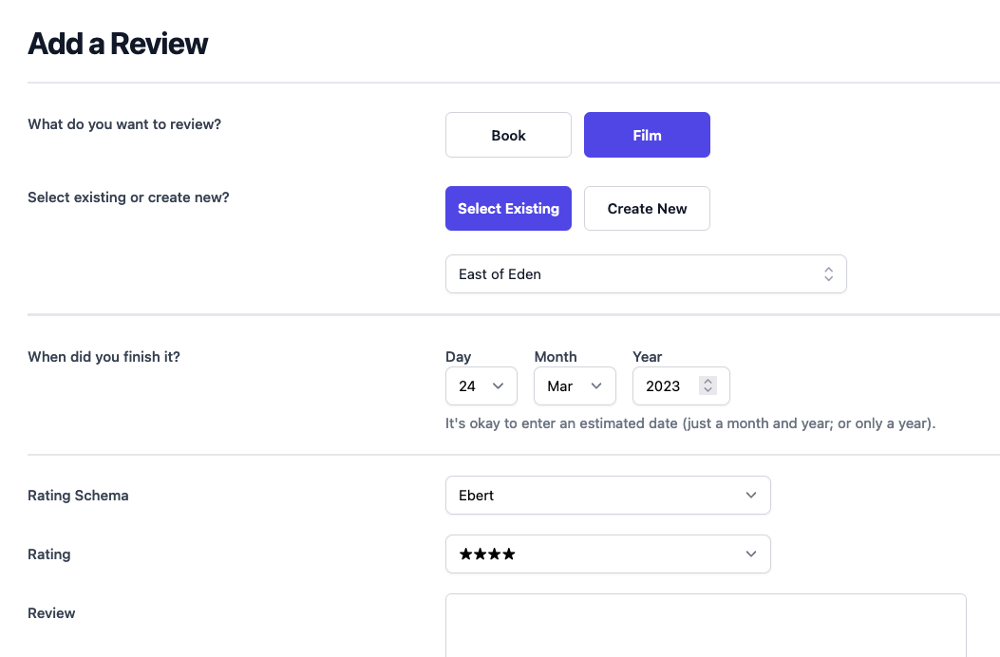

# supergood review site

  

Unlike every other review site, the *Supergood Review Site™* allows users to choose their own rating schema they want to use for reviewing a work of media. Scale of 1 to 10? 4 stars out of 5? Thumbs up / thumbs down? The choice is yours.

## Table of Contents
- [Table of Contents](#table-of-contents)
- [What features does this app have?](#what-features-does-this-app-have)
- [Getting Started](#getting-started)
  - [Installation](#installation)
  - [Running Locally](#running-locally)
  - [Development Guide](#development-guide)
  - [Thanks](#thanks)

## What features does this app have?

This is an experimental demo app for applying advanced web development features to django templates. My goal was to implement a fairly complicated form page to test how far I could push the capabilites of django templating before needing to use a totally decoupled frontend. To do this, I used [Vue](https://vuejs.org/) to progessively enhance a django form template.

Some of this app's most compelling features are:
- Vue SFC (Single File Componets) rendered as django templates
- Autocomplete dropdown form fields
- Support for GenericForeignKeys within ModelForms
- Conditional form sections
- TailwindCSS and HeadlessUI for styling
- Modern js tooling: typescript, linting, bundling with Vitejs
- Browser testing using jest and puppeteer
- An inevitable datepicker

In retrospect, I actually would *not* recommend this approach to other developers. It is possible, though very complicated, to mix django form templates with Vue. For some features (like toggling the "required" attribute for hidden form fields), jquery would have been much easier to use. For other features (like binding form inputs to vue store values), it would have been easier to implement them within a decoupled standalone Vue app -- without having to worry about translating data from the django context into the Vue virtualDOM. But I wouldn't have known that if I haven't tried it. And now you don't have to.

I implemented every feature to the best of my admittedly limited Vue abilities. It's possible that there are some Vue techniques that I'm unaware of that would have made the code cleaner or the development experience easier.

I hope this is fun for you to explore! I haven't seen any public examples of some of these features, so I thought it would be neat to try them out. A slew of blog posts is forthcoming which will explain how everything works.

## Getting Started

### Installation
1. Install Python
   - I recommend using [pyenv](https://github.com/pyenv/pyenv) to manage installations of python. Pyenv allows you to install and use multiple versions of python on the same computer.
   - After pyenv is installed, run `pyenv local` inside this directory to install the version of python3 specified by the `.python-version` file.
   - If you really don't want to use pyenv, any version of python 3.x should work fine.
2. Install Poetry
   - Poetry is the python dependency manager that this project uses. It can be installed [here](https://python-poetry.org/).
3. Install python packages with Poetry.
   - `make install`
4. Create a .env file.
   - `make .env`
5. Install Nodejs
6.
   - I recommend using [nvm](https://github.com/nvm-sh/nvm) to manage installations of node. nvm (node version manager) allows you to install and use multiple versions of nodejs on the same computer.
   - After nvm is installed, run `nvm use` inside this directory to install the version of nodejs specified by the `.nvmrc` file.
7. Install Nodejs packages
   - `npm install`
8. Run initial data migrations
   - `poetry run python manage.py migrate`
9. Install seed data
   - `poetry run python manage.py supergood_reads_load_test_data`

### Running Locally
Now that your dependencies have been installed, you're ready to run the app.

1. Start the django server.
   - `make up`
2. In a separate terminal window, start the nodejs server.
   - `make vite`
   - Note: both servers must be running at the same time for the app to function.
3. Navigate to `http://localhost:8000/app/review` to try out the form.
4. The app is not yet complete. The only thing that is finished is the review form itself -- there isn't yet a page that renders all of the reviews you've inputted. But you can inspect the raw data:
   - `make shell`
   - Once inside the shell, you can look at your raw django data. Example: `Review.objects.all()`

### Development Guide

If you want to make contributions to the project, you need to run one additional installation step.

1. Install nox
   - `pip install --upgrade nox`
   - [Nox](https://nox.thea.codes/en/stable/index.html) is used to manage the execution of this test suite. Nox is useful for testing reuseable external libraries that require testing across multiple versions of python or django.
2. Install pre-commit
   - https://pre-commit.com/#install to install the pre-commit program itself.
   - `pre-commit install` to install the pre-commit hooks for this particular project.

And now you have access to these additonal commands:
1. Run the python test suite.
   - `make pytest`
2. Run the javascript test suite.
   - `make jest`
3. Run linting for all files of the project.
   - `make lint`
4. Check for vulnerabilities in external packages.
   - `make safety`
5. Check for type errors in python code.
   - `make mypy`

### Thanks

Test data was provided by these datasets:
- ["7k books" from Kaggle](https://www.kaggle.com/datasets/dylanjcastillo/7k-books-with-metadata)
- ["IMDB Top 1000 movies" from Kaggle](https://www.kaggle.com/datasets/arthurchongg/imdb-top-1000-movies)
- [BFI 2022 Greatest Films of All Time](https://www.bfi.org.uk/sight-and-sound/greatest-films-all-time)
- [BFI 2022 Greatest Films of All Time (Director's Poll)](https://www.bfi.org.uk/sight-and-sound/directors-100-greatest-films-all-time)
